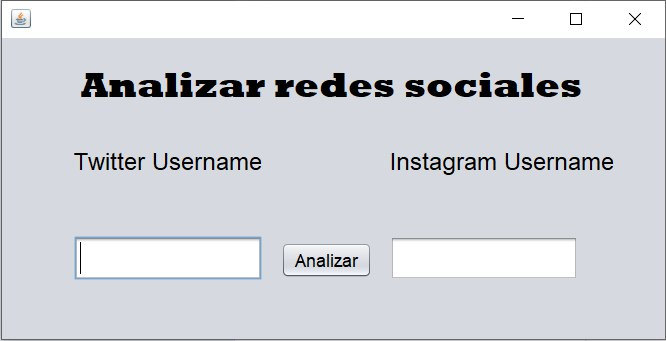
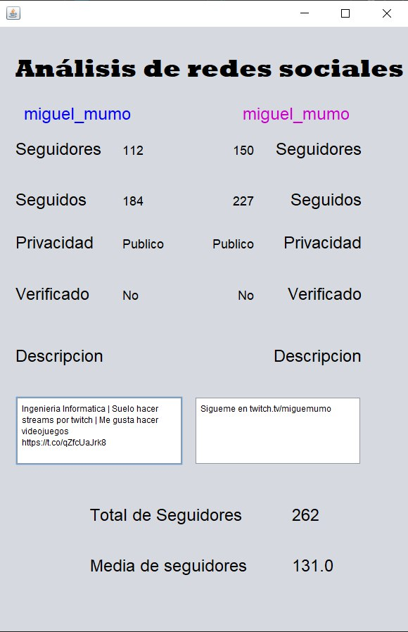
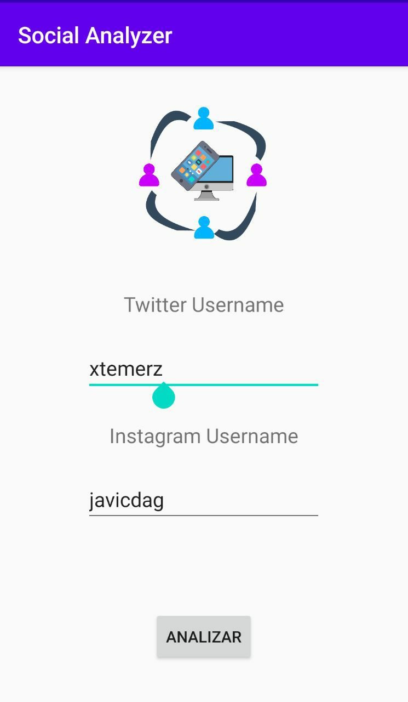
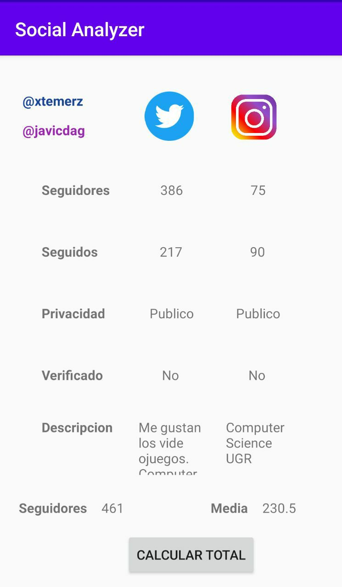

# DS_Practica3
Práctica 3 de la asignatura DS en el curso 19/20

- Nombre de la aplicación: Social Analyzer
- Participantes:
	- Francisco Javier Casado de Amezúa
	- Miguel Muñoz Molina
- Descripción: La idea es realizar una aplicación multiplataforma, tanto para pc como para android, en el que pasando tu nombre de usuario de twitter e instagram, te muestre estadísticas de ambas redes sociales.

## Logo de la aplicación

Hemos diseñado un logo propio para nuestra aplicación.

## Aplicación de Escritorio

Para su realización hemos usado Netbeans, creando una interfaz gráfica. Algunos ejemplos pueden ser los siguientes:

## Aplicación de Móvil

Para su realización hemos usado Android Studio, creando una interfaz gráfica, todo realizado mediante un port de la aplicación de pc a móvil. No ha sido necesario perder ninguna funcionalidad, pero hemos tenido que optimizar el espacio para la pantalla reducida de móviles.

## Memoria de la práctica

Para documentar correctamente esta práctica de cara a su corrección, hemos hecho una memoria en formato pdf que describe de forma más detallada todo el proceso de creación de este software. Se pude consultar la memoria pinchando en el siguiente enlace:

[Memoria Práctica 3 | DS 19/20](./pdf/P3_MemoriaFinal_DS2.pdf)

## Códigos del programa

#### Versión PC

Se puede ver el código de la aplicación a través del siguiente enlace:

[Versión PC Netbeans](./code/PC/TomCat_DS)

#### Versión Android

Se puede ver el código de la aplicación a través del siguiente enlace:

[Versión Móvil AndroidStudio](./code/Android/DS_P3)
